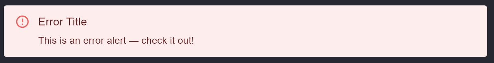
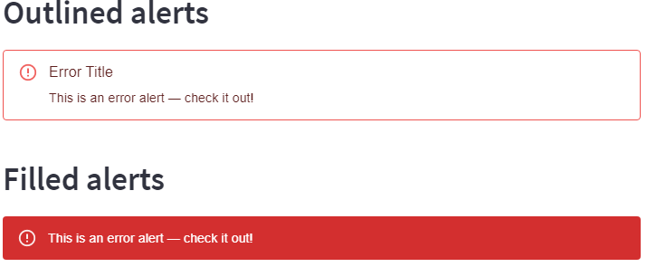

## **Streamlit Alert Components Based on https://mui.com/material-ui/react-alert/**


✅: Done
🚧: In Progress
❌: Not Started

### **Roadmap**
- Basic alerts: ✅
- Description: ✅
- Actions: ❌
- Icons: ❌
- Variants (Outlined, Filled): ✅
- Snackers: 🚧

### **Issues**
- Snackers Position can't be changed


## **Basic Alerts**
``` py

from streamlit_alert_component import streamlit_alert

streamlit_alert("This is an error alert — check it out!", "error")
streamlit_alert("This is a warning alert — check it out!", "warning")
streamlit_alert("This is an info alert — check it out!", "info")
streamlit_alert("This is a success alert — check it out!", "success")
```
  


## **Description Alerts**
``` py 
streamlit_alert("This is an error alert — check it out!", "error", "Error Title")
```
  


## **Variants Alerts**
``` py
streamlit_alert("This is an error alert — check it out!", "error", "Error Title", variant="outlined")

streamlit_alert("This is an error alert — check it out!", "error", variant="filled")
```
  

## **Snackbars Alerts**
``` py
streamlit_alert("This is an error alert — check it out!", "error", "Error Title", variant="outlined", snackbar=True)

streamlit_alert("This is an error alert — check it out!", "error", variant="filled", snackbar=True)
```