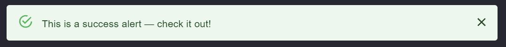

# Streamlit Alert Components Based on https://mui.com/material-ui/react-alert/

# Roadmap
✅: Done
🚧: In Progress
❌: Not Started

- Basic alerts: ✅
- Description: ✅
- Actions: ❌
- Icons: ❌
- Variants (Outlined, Filled): ✅
- Snackbars: 🚧

# Issues
- Snackbars Position can't be easily changed

# 📚 Documentation
``` py
from streamlit_alert_component import streamlit_alert
```
## 🔧 Functions
``` py
def streamlit_alert(
    message,
    key=None,
    severity="info",
    title=None,
    variant="standard",
    snackbar=False):
```
## Arguments
- ### Required
> ***message***: The message to display.  
- ### Optional
> ***key***: Key for Streamlit  
> ***severity***: The severity of the alert. This defines the color and icon used (error | info | warning | success).
> ***title***: Display a formatted title above the content.  
> ***variant***: The variant to use. (filled | outlined | standard).  
> ***title***: Display a formatted title above the content.  
> ***snackbar***: Alert is a snackbar see (https://mui.com/material-ui/react-snackbar/).

## **Basic Alerts**
``` py
streamlit_alert("This is an error alert — check it out!", severity="error")
streamlit_alert("This is a warning alert — check it out!", severity="warning")
streamlit_alert("This is an info alert — check it out!", severity="info")
streamlit_alert("This is a success alert — check it out!", severity="success")
```
 


# 🎨 Demos
## Description Alerts
``` py 
streamlit_alert("This is an error alert — check it out!", severity="error", title="Error Title")
```
 

## Variants Alerts
``` py
streamlit_alert("This is an error alert — check it out!", severity="error", title="Error Title", variant="outlined")

streamlit_alert("This is an error alert — check it out!", severity="error", variant="filled")
```
  

## Snackbars Alerts
``` py
streamlit_alert("This is a success alert — check it out!", severity="success", snackbar=True)
```
  