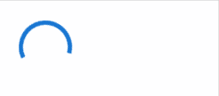
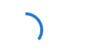
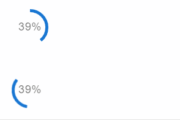

# Streamlit Circular Progress Components Based on https://mui.com/material-ui/react-progress/

# Roadmap
✅: Done
🚧: In Progress
❌: Not Started
- Circular indeterminate : ✅
- Circular color: ❌
- Circular determinate: ✅
- Circular with label: ✅
- Interactive integration: ❌

# 📚 Documentation
``` py
from streamlit_circular_progress_component import streamlit_circular_progress
```

## 🔧 Functions
``` py
def streamlit_circular_progress(
    value=None,
    key=None,
    variant="indeterminate",
    enable_label=False
):
```

## Arguments
- ### Optional
> ***value***: The current progress value.  
> ***key***: Key for Streamlit  
> ***variant***: The variant to use. ( determinate | indeterminate  )
> ***enable_label***: Display the current progress.  


# 🎨 Demos
## Indeterminate Progress
``` py
streamlit_circular_progress()
```

  

## Determinate Progress
```py
streamlit_circular_progress(35, variant="determinate")
```
  

## Determinate Progress With Label
```py
streamlit_circular_progress(39, variant="determinate", enable_label=True)
streamlit_circular_progress(39, variant="indeterminate", enable_label=True)
```
  
