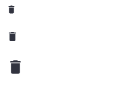
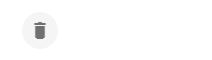
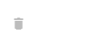

## **Streamlit Icon Components Based on https://mui.com/material-ui/material-icons/**


✅: Done
🚧: In Progress
❌: Not Started

### **Roadmap**
- Icon Only : ✅
- Button with Icon: ✅

## **Icon Size**
``` py
from streamlit_icon_component import streamlit_icon

streamlit_icon("delete_icon", icon_size="small")
streamlit_icon("delete_icon", icon_size="medium")
streamlit_icon("delete_icon", icon_size="large")
```
  

## **Icon Button**
``` py   
streamlit_icon("delete_icon", icon_type="button")
```
  

## **Disabled Icon Button**
``` py
streamlit_icon("delete_icon", icon_type="button", disabled=True)
```
  