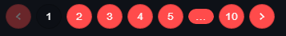
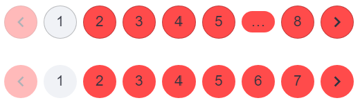
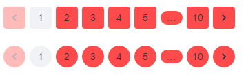

# **Streamlit Pagination Components Based on https://mui.com/material-ui/react-pagination/**


# Roadmap
✅: Done
🚧: In Progress
❌: Not Started
- Basic pagination : ✅
- Variant pagination : ✅
- Shape pagination : ✅
- Colors: ✅
- Pagination size :❌
- Buttons : ❌
- Custom icons :❌
- Pagination ranges : ❌
- Controlled pagination :❌
- Router integration :❌
- Table pagination :❌


# 📚 Documentation
``` py
from streamlit_pagination_component import streamlit_pagination
```
## 🔧 Functions
``` py
def streamlit_pagination(
    page,
    default=1,
    key=None
    variant="text",
    shape="circular"
    background_color=None,
    background_hover_color=None,
    background_selected_color=None,
    text_color=None,
    text_hover_color=None
):
```
## Arguments
- ### Required
> ***page***: The total number of pages.  


> ***default***: The page selected by default when the component is uncontrolled. 
> ***key***: Key for Streamlit

- ### Style
> ***variant***: The variant to use (outlined | text)  
> ***shape***: The variant to use (circular | rounded)

- ### Colors
> ***background_color***: Background color of not selected items  
> ***background_hover_color***: Background color of hovered item   
> ***background_selected_color***: Background color of selected item  
> ***text_color***: Text color of items  
> ***text_hover_color***: Text color of hovered item 


# 🎨 Demos
## Basic Pagination

``` py    
with st.sidebar:
    page = streamlit_pagination(page=10)
```
 

## Variants Pagination
``` py
page = streamlit_pagination(page=10, variant="outlined")
page = streamlit_pagination(page=10, variant="text")
```



## Shaped Pagination
``` py
page = streamlit_pagination(page=10, shape="rounded")
page = streamlit_pagination(page=10, shape="circular")
```


